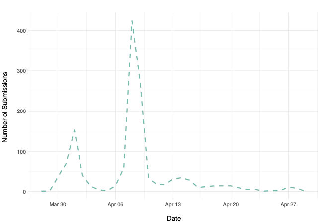

# "Liefer- und Abholdienste" - COVID-19 City Lab Project

&nbsp;

### 1. Context

&nbsp;

In the wake of the ongoing COVID-19 crisis, it quickly became clear that restaurants and other businesses in Berlin would need to seek out new ways of reaching their customers in order to survive financially. As a result, many started offering delivery and pick-up services for the first time. But then these businesses faced a new challenge: getting the word out to potential customers – new and existing – that they remained open for business.

&nbsp;

To help support the local economy, the Berlin Senate Department for Economics, Energy and Public Enterprises – working with the Chamber of Commerce and Industry of Berlin (IHK Berlin), the Association of Hotels and Restaurants in Berlin (DEHOGA Berlin), the Berlin-Brandenburg Trade Assocation (Handelsverband Berlin-Brandenburg), the CityLAB Berlin and the Open Data Service Point (ODIS) – published an open dataset containing businesses in Berlin that are currently offering pickup and/or delivery options for their goods. It encompasses the address, geographic coordinates, type of goods and services, contact information and opening hours of each business. 

&nbsp;

### 2. Collecting the Data

&nbsp;

Data was collected by ODIS using a Typeform online survey shared with businesses through various networks, such as the Chamber of Commerce’s newsletter and the CityLAB’s Twitter account, among others. Responses were automatically saved in an online Google Spreadsheet. Each business' contact information, opening times and description were stored in a single row.

&nbsp;

As of of April 29th, 2020, 1,120 responses (each representing a single business) had been collected. Most of these submissions were made during the first and the second week of April, following the publicization of this initiative in the German media and through emails from the Chamber of Commerce and Industry of Berlin to its members (with the peaks below representing the timing of those two e-mails).

&nbsp;

**Figure 1: Number of Daily Submissions**

&nbsp;

#### 1.2 Redrawing Geodata

&nbsp;

&nbsp;

&nbsp;

&nbsp;

