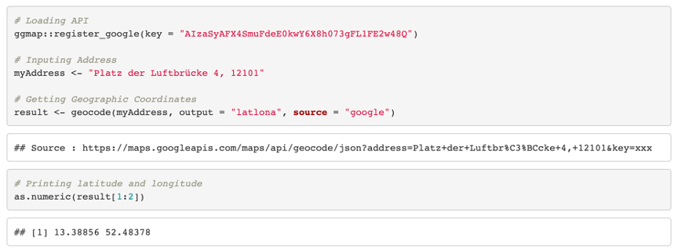
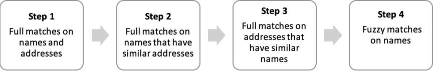

# Liefer- und Abholdienste (COVID-19 City Lab Project)

&nbsp;

---

### 1. Context

&nbsp;

In the wake of the ongoing COVID-19 crisis, it quickly became clear that restaurants and other businesses in Berlin would need to seek out new ways of reaching their customers in order to survive financially. As a result, many started offering delivery and pick-up services for the first time. But then these businesses faced a new challenge: getting the word out to potential customers – new and existing – that they remained open for business.

&nbsp;

To help support the local economy, the Berlin Senate Department for Economics, Energy and Public Enterprises – working with the Chamber of Commerce and Industry of Berlin (IHK Berlin), the Association of Hotels and Restaurants in Berlin (DEHOGA Berlin), the Berlin-Brandenburg Trade Assocation (Handelsverband Berlin-Brandenburg), the CityLAB Berlin and the Open Data Service Point (ODIS) – published an open dataset containing businesses in Berlin that are currently offering pickup and/or delivery options for their goods. It encompasses the address, geographic coordinates, type of goods and services, contact information and opening hours of each business. 

&nbsp;

---

### 2. Collecting the Data

&nbsp;

Data was collected by ODIS using a Typeform online survey shared with businesses through various networks, such as the Chamber of Commerce’s newsletter and the CityLAB’s Twitter account, among others. Responses were automatically saved in an online Google Spreadsheet. Each business' contact information, opening times and description were stored in a single row.

&nbsp;

As of of April 29th, 2020, 1,120 responses (each representing a single business) had been collected. Most of these submissions were made during the first and the second week of April, following the publicization of this initiative in the German media and through emails from the Chamber of Commerce and Industry of Berlin to its members (with the peaks below representing the timing of those two e-mails).

&nbsp;

**Figure 1: Number of Daily Submissions**


&nbsp;


Most of the survey questionnaire was open-ended, with respondents being free to enter their answers in text boxes, rather than by selecting from a set of predefined options. On the one hand, this allowed for more flexibility in the data collection process and increased the user-friendliness of the survey (it also enabled the survey to be quickly created, since there was no need for custom coding). On the other hand, however, this format created the need for subsequent data cleaning before the data could be published and reused by a wider audience. 

&nbsp;

Our workflow for this project was the following. The data generating process was conducted using Typeform, which automatically saved businesses' responses in a Google Spreadsheet. This dataset was then exported as a .csv file and cleaned using R, an open-source programming language. Some additional variables, such as geographic coordinates and unique user IDs, were also generated during this step. Finally, a clean .csv file was exported from R and uploaded in a new Google Spreadsheet for a final, manual check-up.

&nbsp;

**Figure 2: Project Workflow**


&nbsp;

---

### 3. Cleaning and Analyzing the Data


&nbsp;

Our main coding efforts concentrated on three elements: (1) standardizing opening times, (2) standardizing addresses and converting them into geographic coordinates and (3) generating unique IDs. 


&nbsp;

---

#### 	3.1 Standardizing Opening Times


&nbsp;

Our first challenge consisted in uniformizing businesses' opening times. In the Typeform survey, respondents were requested to fill out their opening hours for each day of the week using the following format: "XX:XX-XX:XX". However, many entries did not fit this requested format, typically because (1) opening times were entered using an alternative notation (ex.: "12 bis 18 Uhr", "12-18", "12.00 bis 18.00 Uhr", etc.) or because (2) opening times for the entire week were encompassed in the question which inquired for Monday's opening hours. We thus needed to write code that would automatically recognize and – when possible – correct these discrepancies. 

&nbsp;

---

**OBJECTIVE**: *Display correctly formatted opening times (XX:XX-XX:XX) on days during which businesses are open or empty cells on days during which they are closed*

---

&nbsp;


A first series of manipulations were conducted using R's base `gsub()` function, which replaces strings (i.e. letters, numbers, symbols, punctuation, etc.) with other strings of one's choosing. Strings indicating specific concepts or opening times, as well as common typos---such as using ";" instead of ":"---were the central concern of these initial modifications.

&nbsp;

**Table 1: Common String Replacements Using `gsub()`**


| Original String             | Modified String |
|-----------------------------|-----------------|
| "bis"                       | "-"             |
| ";"                         | ":"             |
| "den ganzen Tag/ganzen Tag" | "00:00-00:00"   |
| "Ruhetag/geschlossen"       | ""              |


&nbsp;


The next series of manipulations concentrated on generating opening times composed strictly of 11 characters (i.e. following the "XX:XX-XX:XX" format). Our code thus needed to add the correct number of missing characters to incorrect opening times patterns without generating inappropriate outputs for all entries. After removing white spaces, the typical incorrect formats and their associated number of characters were the following.


&nbsp;

**Table 2: Common Incorrect Time Formatting**


| Error Type | Original Format | Number of Characters | Corrected Format |
|------------|-----------------|----------------------|------------------|
| A          | "12-18"         | 5                    | "12:00-18:00"    |
| B          | "12-18:00"      | 8                    | "12:00-18:00"    |
| C          | "12:00-18"      | 8                    | "12:00-18:00"    |
| D          | "9:00-18:00:    | 10                   | "09:00-18:00"    |

&nbsp;

Here, the strategy had to be thought of sequentially:

-	**Error Type A & C**: First, we pasted ":00" to all strings using R's base paste() function. All closing times that were correctly formatted thus ended with ":00:00" (for instance: "12:00-18:00:00")---which made it easy to convert this ":00:00" string back to its original ":00" using gsub(). Similarly, any ":30:00" ending for stores having correctly inputted a mid-hour closing time was rep**laced by ":30". 
-	**Error Type A & B**: Second, we added an extra ":00" before the "-" punctuation symbol to all strings in which that symbol was not already preceded by ":00".
-	**Error Type D**: Third, we added a "0" at the beginning of all strings composed of less than 11 characters. This "0" was subsequentially removed in strings encompassing three numbers before the first occurrence of the ":" punctuation symbol, keeping the addition solely for single-digit opening times initially missing a "0".

&nbsp;

After these modifications, each cell containing strings that didn't match the following regular expression were flagged and replaced by the mention "DOUBLE-CHECK".

&nbsp;

```^\\d{2}:\\d{2}[\\-]\\d{2}:\\d{2}$```

*(Translation: "XX:XX-XX:XX", where each X is a digit between 0 and 9)*

&nbsp;

These "DOUBLE-CHECK" entries were manually corrected using original answers from the initial Google Spreadsheet during our final check-up. Most of these flagged entries were generated by the typical mistakes inherent to open-ended surveys (ex.: unforeseen typos, incorrectly answered survey questions, etc.), but some were legitimate attempts to convey complex information, such as double daily opening times (ex.: "09:00-14:00 & 16:00-21:00"). Frequently recurring flagged elements were taken into account to further improve the code.

&nbsp;

---

**LESSON LEARNED**: *It is almost impossible to predict the number of different variations that can be generated by open-ended survey questions. Automatically correcting most common mistakes is important, but we also need to implement alternative methods to double-check final discrepancies manually.*

---


&nbsp;

---

#### 	3.2 Standardizing Addresses and Getting Geographic Coordinates


&nbsp;

Our second step was the standardization and geocoding of addresses. Since these were originally submitted using an open-ended survey question, we saw businesses using various types of formatting. In the data-cleaning process, all abbreviations (ex.: "Str", "str.", "-str.", "-Str.") were replaced by their full version "Straße" or "-Straße". Extra white spaces at the beginning and/or at the end of each string were also removed. We then proceeded to merge postal codes – which were submitted in another survey question – to businesses' addresses in order to ensure that locations were correctly identified as within the boundaries of Berlin, rather than in other cities across the country (for example, the street and house number combination of “Brückenstraße 60” exists in Frankfurt am Main as well as in Berlin – only through the postal code was it possible to ensure we were generating the correct coordinates for the address provided). Postal codes were thus pasted to addresses using the paste() function to avoid matching incorrect locations (for instance, to avoid confusion between "Brückenstraße 60" in 10179, Berlin and the same address in 60594, Frankfurt am Main).

&nbsp;

---

**OBJECTIVE**: *Display uniform addresses and generate geocoordinates based on these addresses*

---

&nbsp;

To convert addresses to geographic coordinates, we used Google’s Geocoding API. Here is an example code and output for one single address.

&nbsp;



&nbsp;

Our actual code employed a loop to automatize this process for all inputted addresses. Entries that could not be recognized by Google, for instance due to major typos, were removed from the dataset. Finally, all addresses whose postal codes did not match the registered postal codes for the area of Berlin were also removed from the dataset.


---

**LESSON LEARNED**: *We started by using solely street addresses (without postal codes) to match Berlin stores, until the Google API matched an entry with an address outside of Berlin, while that business that was actually located within the city. From then on, we included postal codes to ensure that we matched addresses solely within Berlin---and not similar addresses within other cities in Germany.*

---


&nbsp;

---

#### 	3.3 Standardizing Addresses and Getting Geographic Coordinates


&nbsp;

The third main step of our analysis was to generate a unique ID for each business; this makes it easier for users of the dataset to track the way it changes over time. The generation of unique IDs was done using a simple sequencing of numbers on unique entries. To do this however, we first had to go through the dataset to identify and remove duplicate entries (i.e., businesses who had entered themselves twice for some reason). This process was more complicated than just looking for identically named businesses, however, since some businesses have the same name at multiple locations (and thus might be wrongly marked as duplicates if addresses are not also compared), and in other cases, typos in one entry made it difficult to automatically spot what were actually duplicate entries. 

&nbsp;

---

**OBJECTIVE**: *Remove all duplicated entries and generate unique IDs for each business*

---

&nbsp;

Our initial technique was simple: automatically removing all entries with perfectly matching names and addresses. However, many duplicates actually encompassed changes within their names or addresses, mostly due to typos or varying abbreviation use. We therefore needed additional steps to ensure the removal of all duplicates.

&nbsp;

To that end, two types of matching were employed to identify and remove remaining duplicates. First, we used dyplyr's filter() and group_by() functions to match all (1) business names and (2) business addresses, creating two tables indicating any perfect matches on either variable. Second, we performed fuzzy matching (i.e. approximate string matching) using the stringdist package in order to identify each business name's closest match within the dataset. This allowed us to catch some duplicates for which the store's name was different in both entries without being full matches (for instance, businesses entering their name once with a "-", and once without it).

&nbsp;

**Figure 3: Duplicates Removing Process**



&nbsp;

Unique IDs were kept constant despite the occurrence of new duplicates in each wave of submissions. For each duplicated entry, we deleted the initial row associated with that business during our final check-up in the Google Spreadsheet, but saved and assigned its original ID to its latest entry.

---

**LESSON LEARNED**: *Double-checking results multiple times is important. We originally employed steps 1 to 3 (in Figure 3) to remove duplicates, wrongly assuming that every duplicated entry would have at least one full match, either on their name or on their address. However, some entries included typos or format modifications for both variables, which made fuzzy matching necessary as an additional sanity check.*

---

&nbsp;


&nbsp;


&nbsp;


&nbsp;


&nbsp;


&nbsp;

